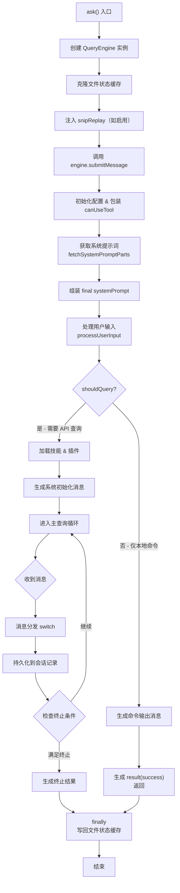
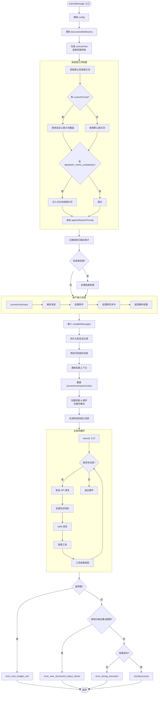
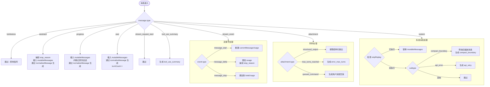
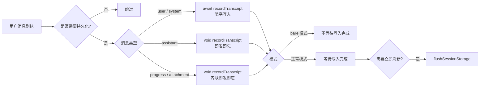
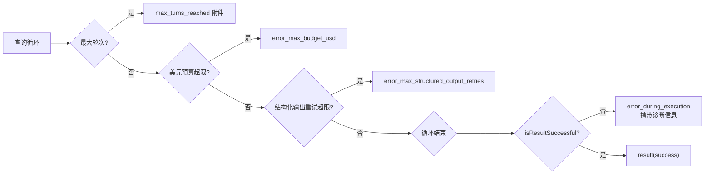

# QueryEngine 代码分析文档

> 文件路径: `src/QueryEngine.ts`
> 职责: 查询生命周期与会话状态管理

---

## 1. 概述

`QueryEngine` 是 Claude Code 的核心查询引擎，负责管理一次对话的完整生命周期。它将 `ask()` 的核心逻辑提取为独立类，同时支持**无头/SDK 模式**和**交互式 REPL**。

**核心职责:**
- 管理可变消息列表（跨轮次持久化）
- 构建系统提示词（含自定义提示词、记忆机制、插件/技能上下文）
- 处理用户输入（解析消息、附件、斜杠命令）
- 驱动主查询循环（与 Claude API 交互、处理工具调用）
- 追踪 API 用量、权限拒绝、预算限制
- 持久化会话记录以支持恢复（`--resume`）
- 支持历史压缩（snip）以避免长会话内存泄漏

---

## 2. 架构总览

```
┌──────────────────────────────────────────────────────────┐
│                         ask()                            │
│               (一次性使用便捷封装)                          │
│                                                          │
│  ┌──────────────────────────────────────────────────────┐ │
│  │                  QueryEngine                          │ │
│  │               (查询生命周期管理器)                       │ │
│  │                                                      │ │
│  │  ┌──────────────────────────────────────────────────┐│ │
│  │  │           submitMessage()                        ││ │
│  │  │         (提交消息，开启新一轮查询)                   ││ │
│  │  │                                                  ││ │
│  │  │  1. 初始化配置 & 包装 canUseTool                  ││ │
│  │  │  2. 获取系统提示词 & 构建 systemPrompt            ││ │
│  │  │  3. 处理用户输入 (processUserInput)               ││ │
│  │  │  4. 持久化用户消息到会话记录                       ││ │
│  │  │  5. 加载技能 & 插件 (仅缓存)                     ││ │
│  │  │  6. 生成系统初始化消息                            ││ │
│  │  │  7. 进入主查询循环 (query loop)                   ││ │
│  │  │  8. 检查终止条件 & 生成结果                       ││ │
│  │  └──────────────────────────────────────────────────┘│ │
│  └──────────────────────────────────────────────────────┘ │
└──────────────────────────────────────────────────────────┘
```

### 2.1 模块依赖关系

```
QueryEngine.ts 依赖的主要模块:
  ├── bootstrap/state.js        — 会话 ID、持久化状态
  ├── services/api/claude.js    — API 用量累加
  ├── query.js                  — 主查询循环（核心 API 交互）
  ├── commands.js               — 斜杠命令 & 技能
  ├── cost-tracker.js           — 成本追踪
  ├── memdir/                   — 记忆机制
  ├── Tool.js                   — 工具系统
  ├── utils/                    — 工具函数集合
  │   ├── processUserInput/     — 用户输入处理
  │   ├── sessionStorage.js     — 会话记录持久化
  │   ├── fileHistory.js        — 文件历史快照
  │   ├── model/                — 模型管理
  │   └── messages/             — 消息映射 & 系统初始化
  └── services/                 — MCP、插件等外部服务
```

---

## 3. 核心类型与结构

### 3.1 `QueryEngineConfig` 配置项

| 配置项 | 类型 | 说明 |
|--------|------|------|
| `cwd` | `string` | 当前工作目录 |
| `tools` | `Tools` | 可用工具集合 |
| `commands` | `Command[]` | 斜杠命令列表 |
| `mcpClients` | `MCPServerConnection[]` | MCP 客户端连接 |
| `agents` | `AgentDefinition[]` | 可用代理定义 |
| `canUseTool` | `CanUseToolFn` | 工具权限检查函数 |
| `readFileCache` | `FileStateCache` | 文件状态缓存 |
| `customSystemPrompt` | `string?` | 自定义系统提示词（覆盖默认） |
| `appendSystemPrompt` | `string?` | 追加到系统提示词末尾 |
| `userSpecifiedModel` | `string?` | 用户指定模型 |
| `thinkingConfig` | `ThinkingConfig?` | Extended Thinking 配置 |
| `maxTurns` | `number?` | 最大对话轮次 |
| `maxBudgetUsd` | `number?` | 最大预算（美元） |
| `jsonSchema` | `Record?` | 结构化输出 JSON Schema |
| `snipReplay` | `function?` | 历史压缩边界处理器 |
| `orphanedPermission` | `OrphanedPermission?` | 孤悬权限（前轮未完成的权限请求） |

### 3.2 `QueryEngine` 类属性

| 属性 | 可见性 | 说明 |
|------|--------|------|
| `config` | `private` | 引擎配置 |
| `mutableMessages` | `private` | 可变消息列表 |
| `abortController` | `private` | 中止控制器 |
| `permissionDenials` | `private` | 权限拒绝记录（用于 SDK 报告） |
| `totalUsage` | `private` | 累计 API 用量 |
| `readFileState` | `private` | 文件状态缓存 |
| `discoveredSkillNames` | `private` | 技能发现追踪集合 |
| `loadedNestedMemoryPaths` | `private` | 已加载的嵌套记忆路径集合 |

---

## 4. 核心执行流程

### 4.1 总体流程 (`ask()` → `submitMessage()` → 结果)



### 4.2 `submitMessage()` 详细流程



### 4.3 消息处理 Switch 分支



### 4.4 会话记录持久化策略



---

## 5. 关键方法详解

### 5.1 `submitMessage(prompt, options?)`

```
输入: prompt (string | ContentBlockParam[])
      options.uuid (string?) — 消息 UUID
      options.isMeta (boolean?) — 是否为元消息
输出: AsyncGenerator<SDKMessage, void, unknown>
```

**执行步骤:**

1. **初始化阶段**
   - 清除上一轮的 `discoveredSkillNames`
   - 设置工作目录 (`setCwd`)
   - 包装 `canUseTool` 以追踪权限拒绝记录

2. **系统提示词构建**
   - 调用 `fetchSystemPromptParts()` 获取默认提示词 + 用户上下文
   - 检查 `CLAUDE_COWORK_MEMORY_PATH_OVERRIDE` 环境变量，有条件地注入记忆机制提示词
   - 组装最终 `systemPrompt`（自定义 → 默认 → 记忆 → 追加）

3. **用户输入处理**
   - 调用 `processUserInput()` 解析用户输入（斜杠命令、附件、消息体）
   - 将解析后的消息推入 `mutableMessages`
   - **关键**: 在进入 API 查询循环 **之前** 将用户消息持久化到会话记录，确保即使进程被终止也能恢复对话

4. **技能 & 插件加载**
   - 仅从缓存加载（避免网络阻塞）
   - 生成 `buildSystemInitMessage()` 包含所有上下文信息

5. **主查询循环**
   - 调用 `query()` 与 Claude API 交互
   - 按消息类型分发处理（switch 分支）
   - 在每个轮次后检查终止条件:
     - 美元预算超限 → `error_max_budget_usd`
     - 结构化输出重试超限 → `error_max_structured_output_retries`
     - 执行结果异常 → `error_during_execution`
     - 成功 → `result(success)`

### 5.2 `ask()` 便捷函数

```
输入: 同 QueryEngineConfig 大多数参数 + prompt
输出: AsyncGenerator<SDKMessage, void, unknown>
```

**职责:**
- 创建 `QueryEngine` 实例（克隆文件缓存以避免共享状态）
- 注入 `snipReplay` 处理器（当 `HISTORY_SNIP` 功能启用时）
- 代理调用 `engine.submitMessage()`
- **finally**: 确保将更新后的文件状态缓存写回

### 5.3 辅助方法

| 方法 | 说明 |
|------|------|
| `interrupt()` | 通过 `abortController.abort()` 中断当前查询 |
| `getMessages()` | 返回当前会话的消息列表（只读） |
| `getReadFileState()` | 返回文件状态缓存 |
| `getSessionId()` | 返回当前会话 ID |
| `setModel(model)` | 动态切换使用的模型 |

---

## 6. 异常与边界处理

### 6.1 终止条件优先级



### 6.2 会话持久化安全机制

- **实时写入**: 用户消息到达后立即写入会话记录（非助理消息 `await`，助理消息 `void`）
- **延迟刷新**: 在生成最终结果前 `flushSessionStorage()`，确保桌面应用不会因进程被杀而丢失数据
- **水印机制**: 使用引用水印而非长度索引来限定错误范围（避免环形缓冲区轮转导致的索引漂移）

### 6.3 内存安全

- **压缩边界清理**: `compact_boundary` 到达后，`splice` 压缩前的消息释放内存
- **snip 重放**: 通过 `snipReplay` 回调移除僵尸消息和过期标记，防止 SDK 长会话内存泄漏
- **技能发现集合**: 每轮 `submitMessage` 开始前 `clear()`，避免无限增长

---

## 7. 配置与环境变量

| 变量名 | 作用 | 使用位置 |
|--------|------|----------|
| `CLAUDE_COWORK_MEMORY_PATH_OVERRIDE` | 启用记忆机制提示词注入 | 系统提示词构建 |
| `CLAUDE_CODE_EAGER_FLUSH` | 强制每次写入后刷新会话存储 | 多个持久化点 |
| `CLAUDE_CODE_IS_COWORK` | 协同模式标志（同样触发强制刷新） | 多个持久化点 |
| `MAX_STRUCTURED_OUTPUT_RETRIES` | 结构化输出最大重试次数（默认 5） | 重试限制检查 |
| `CLAUDE_CODE_SYNC_PLUGIN_INSTALL` | CCR 插件安装同步模式 | 插件加载（外部） |
| `CLAUDE_CODE_PLUGIN_SEED_DIR` | 插件种子目录 | 插件加载（外部） |

---

## 8. 设计模式与注意事项

### 8.1 使用的设计模式

- **生成器模式 (Generator)**: `submitMessage` 和 `ask` 均为 `AsyncGenerator`，支持惰性流式生成 SDK 消息
- **策略模式**: `snipReplay` 回调由调用者注入，实现可替换的压缩策略
- **装饰器模式**: `wrappedCanUseTool` 在原 `canUseTool` 基础上添加权限追踪能力
- **工厂方法**: `buildSystemInitMessage` 封装系统初始化消息的构建逻辑

### 8.2 关键注意事项

1. **状态一致性**: `mutableMessages` 和 `messages`（快照）的同步维护至关重要，两者不同步会导致恢复失败
2. **轮次间状态持久**: `totalUsage`、`loadedNestedMemoryPaths` 跨轮次保留，而 `discoveredSkillNames` 每轮重置
3. **AI 助手消息的懒惰持久化**: 助手消息使用 `void` 即发即忘写入，依赖写入队列的 100ms 延迟来确保 `message_delta` 能在 `message_stop` 前完成
4. **孤悬权限的一次性处理**: `hasHandledOrphanedPermission` 标志确保在整个引擎生命周期内只处理一次
5. **类型安全**: 使用 `edeResultType` / `edeLastContentType` 变量绕过 TypeScript 类型收窄限制，辅助诊断