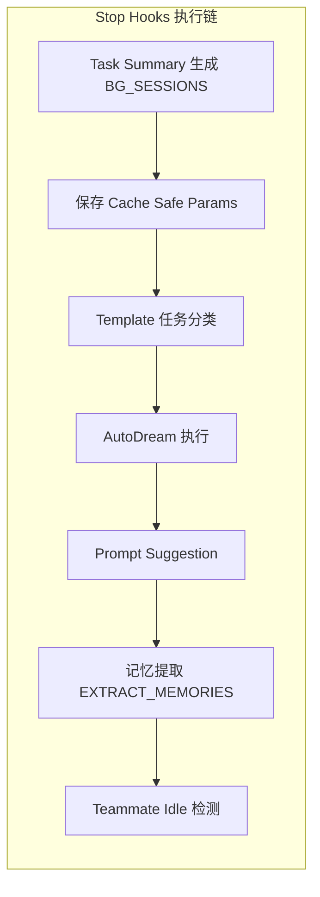

# `query.ts` 项目分析报告

## 一、概述

**文件路径**: `src/query.ts` (约 1900 行)  
**项目**: `@anthropic-ai/claude-code` — Anthropic 官方 CLI 工具，基于 Claude 模型实现 AI 辅助编程交互。  
**核心职责**: 实现 Claude Code 的**主查询循环**（Main Query Loop）—— 即 Agent 与 LLM 模型之间多轮对话的执行引擎。负责消息编排、模型调用、工具执行、上下文压缩、错误恢复等核心流程。

---

## 二、架构定位

```
用户输入
    │
    ▼
┌─────────────────────────────────────────────────┐
│                query.ts (主循环引擎)              │
│  ┌───────────┐  ┌──────────┐  ┌──────────────┐  │
│  │ 消息编排   │  │ 模型调用  │  │ 工具执行      │  │
│  │           │  │          │  │              │  │
│  │ 上下文压缩 │  │ 错误恢复  │  │ Token 预算   │  │
│  └───────────┘  └──────────┘  └──────────────┘  │
└───────────────┬─────────────────────────────────┘
                │
    ┌───────────┴───────────┐
    ▼                       ▼
┌──────────┐         ┌──────────────┐
│ services/ │         │    tools/    │
│   (API)   │         │  (工具定义)   │
└──────────┘         └──────────────┘
```

### 模块依赖关系

| 子模块 | 文件 | 职责 |
|--------|------|------|
| `QueryDeps` | `query/deps.ts` | 定义 I/O 依赖注入接口，便于测试 Mock |
| `QueryConfig` | `query/config.ts` | 快照不可变配置（Session ID、运行时开关） |
| `State` | `query.ts` | 循环间可变状态（消息列表、工具上下文、压缩追踪） |
| `handleStopHooks` | `query/stopHooks.ts` | 模型完成后的钩子处理（模板分类、记忆提取、AutoDream 等） |
| `checkTokenBudget` | `query/tokenBudget.ts` | Token 预算决策（继续/停止/收益递减检测） |
| `Terminal / Continue` | `query/transitions.ts` | 循环终止与继续的联合类型 |

---

## 三、核心数据结构

### `QueryParams` — 查询入口参数

```typescript
type QueryParams = {
  messages: Message[]           // 对话消息历史
  systemPrompt: SystemPrompt    // 系统提示词
  userContext: {...}            // 用户上下文
  systemContext: {...}          // 系统上下文
  canUseTool: CanUseToolFn      // 工具使用权限检查
  toolUseContext: ToolUseContext // 工具运行时上下文
  fallbackModel?: string        // 备用模型
  querySource: QuerySource      // 查询来源标识
  maxOutputTokensOverride?: number // 最大输出 Token 覆盖
  maxTurns?: number             // 最大轮次限制
  skipCacheWrite?: boolean      // 是否跳过缓存写入
  taskBudget?: { total: number } // API Task Budget
  deps?: QueryDeps              // 依赖注入
}
```

### `State` — 循环间可变状态

```typescript
type State = {
  messages: Message[]
  toolUseContext: ToolUseContext
  autoCompactTracking: AutoCompactTrackingState | undefined
  maxOutputTokensRecoveryCount: number
  hasAttemptedReactiveCompact: boolean
  maxOutputTokensOverride: number | undefined
  pendingToolUseSummary: Promise<ToolUseSummaryMessage | null> | undefined
  stopHookActive: boolean | undefined
  turnCount: number
  transition: Continue | undefined
}
```

### 循环终止信号 `Terminal`

```typescript
type Terminal = { reason: 'completed' | 'blocking_limit' | 'prompt_too_long'
                | 'image_error' | 'model_error' | 'aborted_streaming'
                | 'aborted_tools' | 'hook_stopped' | 'stop_hook_prevented'
                | 'max_turns' | ... }
```

---

## 四、核心流程 — 主查询循环

```mermaid
flowchart TD
    START(("query params")) --> INIT["初始化状态: State, BudgetTracker, Config"]
    INIT --> PREFETCH["启动 Memory/Skill 预取"]
    PREFETCH --> LOOP_HEAD{"while true 主循环入口"}

    LOOP_HEAD --> DECONSTRUCT["解构 State 变量"]
    DECONSTRUCT --> SKILL_PREFETCH["启动 Skill Discovery 预取"]
    SKILL_PREFETCH --> STREAM_REQ["发出 stream_request_start 事件"]
    STREAM_REQ --> QUERY_TRACK["初始化/自增 QueryChain 追踪"]
    QUERY_TRACK --> MC_BOUNDARY["获取 Compact 边界后的消息"]
    MC_BOUNDARY --> BUDGET["应用 ToolResult 预算"]
    BUDGET --> SNIP{"HISTORY_SNIP?"}

    SNIP -- Yes --> SNIP_OP["执行 SnipCompact"]
    SNIP_OP --> MICROCOMPACT
    SNIP -- No --> MICROCOMPACT

    MICROCOMPACT["执行 MicroCompact"]
    MICROCOMPACT --> COLLAPSE{"CONTEXT_COLLAPSE?"}

    COLLAPSE -- Yes --> COLLAPSE_OP["执行 ContextCollapse 投影已折叠的上下文"]
    COLLAPSE_OP --> AUTOCOMPACT
    COLLAPSE -- No --> AUTOCOMPACT

    AUTOCOMPACT["执行 AutoCompact 自动上下文压缩"]
    AUTOCOMPACT --> COMPACT_OK{"压缩成功?"}

    COMPACT_OK -- Yes --> YIELD_COMPACT["Yield 压缩摘要消息"]
    YIELD_COMPACT --> UPDATE_TRACKING["更新压缩追踪"]
    UPDATE_TRACKING --> BLOCKING_CHECK
    COMPACT_OK -- No --> BLOCKING_CHECK

    BLOCKING_CHECK{"在阻塞限制? 无 AutoCompact 时"}
    BLOCKING_CHECK -- Yes --> BLOCK_ERR["返回 blocking_limit"]
    BLOCKING_CHECK -- No --> API_LOOP

    subgraph API_LOOP [API 调用循环]
        direction TB
        API_CALL["调用模型 API deps.callModel"] --> STREAMING{"流式接收消息"}

        STREAMING --> TOOL_USE{"发现 tool_use 块?"}
        TOOL_USE -- Yes --> COLLECT_TOOL["收集 ToolUseBlock"]
        COLLECT_TOOL --> EXECUTOR["StreamingToolExecutor 添加待执行工具"]
        EXECUTOR --> STREAMING
        TOOL_USE -- No --> STREAM_DONE
        STREAM_DONE["流式接收完成"]

        API_CALL -- 异常 --> CATCH_ERROR{"FallbackTriggeredError 且有 fallbackModel?"}
        CATCH_ERROR -- Yes --> FALLBACK["切换到备用模型 清除当前助手消息"]
        FALLBACK --> API_CALL
        CATCH_ERROR -- No --> THROW["抛出异常"]
    end

    STREAM_DONE --> POST_SAMPLING["执行 Post-Sampling Hooks"]
    POST_SAMPLING --> ABORTED{"被中断?"}

    ABORTED -- Yes --> ABORT_HANDLE["处理中断 生成 ToolResult 清理 CU"]
    ABORT_HANDLE --> ABORT_RET["返回 aborted_streaming"]

    ABORTED -- No --> NEED_FOLLOWUP{"需要 Tool 跟进?"}

    NEED_FOLLOWUP -- No --> PTL_CHECK{"被 withheld 的 PromptTooLong?"}

    PTL_CHECK -- Yes --> COLLAPSE_DRAIN{"尝试 Collapse Drain 恢复"}
    COLLAPSE_DRAIN -- 成功 --> CONTINUE_LOOP["state = next continue 下一轮"]
    CONTINUE_LOOP --> LOOP_HEAD

    COLLAPSE_DRAIN -- 失败或无 --> REACTIVE_COMPACT{"尝试 Reactive Compact"}
    REACTIVE_COMPACT -- 成功 --> CONTINUE_LOOP
    REACTIVE_COMPACT -- 失败 --> PTL_SURFACE["Surface 错误 return prompt_too_long"]

    PTL_CHECK -- No --> MAX_OUTPUT{"max_output_tokens?"}

    MAX_OUTPUT -- Yes --> ESCALATE{"尝试扩容 8K 到 64K"}
    ESCALATE -- 是 --> ESCALATE_CONT["重新发送请求"]
    ESCALATE_CONT --> CONTINUE_LOOP
    ESCALATE -- 否或已扩容 --> MAX_RECOVER{"小于 3 次恢复?"}
    MAX_RECOVER -- Yes --> INJECT_RECOVERY["注入恢复消息"]
    INJECT_RECOVERY --> CONTINUE_LOOP
    MAX_RECOVER -- No --> SURFACE_MAX["Surface 错误"]

    SURFACE_MAX --> STOP_HOOKS
    MAX_OUTPUT -- No --> STOP_HOOKS

    STOP_HOOKS["执行 Stop Hooks"]
    STOP_HOOKS --> HOOK_BLOCK{"有阻塞错误?"}
    HOOK_BLOCK -- Yes --> INJECT_HOOK_ERR["注入错误消息"]
    INJECT_HOOK_ERR --> CONTINUE_LOOP
    HOOK_BLOCK -- No --> PREVENTED{"阻止继续?"}
    PREVENTED -- Yes --> HOOK_STOP_RET["return stop_hook_prevented"]

    PREVENTED -- No --> TOKEN_BUDGET{"Token Budget 检查"}

    TOKEN_BUDGET -- 需要继续 --> BUDGET_CONT["注入续费消息"]
    BUDGET_CONT --> CONTINUE_LOOP
    TOKEN_BUDGET -- 停止 --> COMPLETED["return completed"]

    NEED_FOLLOWUP -- Yes --> TOOL_EXEC["执行工具 StreamingToolExecutor 或 runTools"]
    TOOL_EXEC --> TOOL_ABORTED{"被中断?"}

    TOOL_ABORTED -- Yes --> TOOL_ABORT_HANDLE["处理中断"]
    TOOL_ABORT_HANDLE --> TOOL_ABORT_RET["return aborted_tools"]

    TOOL_ABORTED -- No --> PREVENT_CONT{"Hook 阻止继续?"}
    PREVENT_CONT -- Yes --> HOOK_STOP["return hook_stopped"]

    PREVENT_CONT -- No --> SUMMARY["生成 ToolUse Summary"]
    SUMMARY --> ATTACHMENTS["获取附件消息 队列命令 Memory Skill"]
    ATTACHMENTS --> REFRESH_TOOLS["刷新工具列表 MCP 新连接"]
    REFRESH_TOOLS --> MAX_TURNS_CHECK{"达到最大轮次?"}

    MAX_TURNS_CHECK -- Yes --> MAX_TURNS_ATT["Yield max_turns 附件"]
    MAX_TURNS_ATT --> TURNS_RET["return max_turns"]

    MAX_TURNS_CHECK -- No --> NEXT_TURN["构造下一轮 State"]
    NEXT_TURN --> CONTINUE_LOOP
```



---

## 五、关键机制详解

### 5.1 多层上下文压缩体系

这是 `query.ts` 最核心的价值所在，解决了长对话中的上下文窗口溢出问题。

| 压缩层级 | 触发时机 | 作用 | 代码位置 |
|----------|----------|------|----------|
| **SnipCompact** | 每轮迭代开始 | 裁剪早期历史，释放 Token | `snipCompactIfNeeded()` |
| **MicroCompact** | Snip 之后 | 细粒度的工具调用结果压缩 | `deps.microcompact()` |
| **ContextCollapse** | MicroCompact 之后 | 投影式折叠，保持历史可读性 | `contextCollapse.applyCollapsesIfNeeded()` |
| **AutoCompact** | Collapse 之后 | 自动摘要压缩（深度压缩） | `deps.autocompact()` |
| **ReactiveCompact** | API 413 错误后 | 响应式压缩，应对 Prompt Too Long | `reactiveCompact.tryReactiveCompact()` |

这些压缩机制按**成本递增**排列：
- Snip/Micro/Collapse 基本免费（不调用模型）
- AutoCompact 调用小模型生成摘要
- ReactiveCompact 是最后一道防线

### 5.2 错误恢复体系

| 错误类型 | 恢复策略 | 最大重试次数 |
|----------|----------|-------------|
| `prompt_too_long` (413) | Collapse Drain → Reactive Compact | 各 1 次 |
| `max_output_tokens` | 扩容 (8K→64K) → 注入续写提示 | 扩容 1 次 + 恢复 3 次 |
| 模型 Fallback | 切换备用模型 | 1 次 |
| 图片尺寸/调整错误 | 返回用户友好错误 | 0 次（直接返回） |
| Media Size 错误 | ReactiveCompact Strip-Retry | 1 次 |

### 5.3 Token Budget 机制

- 基于 `TOKEN_BUDGET` 特性开关
- 用 `BudgetTracker` 追踪轮次消耗
- **90% 阈值**触发继续决策
- **收益递减检测**: 连续 3 次关注产 Token < 500 时停止
- 产生 `tengu_token_budget_completed` 事件用于分析

### 5.4 Stop Hooks 后处理



### 5.5 Streaming Tool Execution

- 通过 `StreamingToolExecutor` 实现工具执行的**流式并行化**
- 模型还在流式输出时，已完成工具即可开始执行
- 基于 Statsig 门控 `tengu_streaming_tool_execution2`
- 对比传统方式：**串行等待模型完成 → 批量执行工具**
- 中断时调用 `getRemainingResults()` 生成合成 `tool_result`

### 5.6 预取机制

| 预取类型 | 启动时机 | 消费时机 | 目的 |
|----------|----------|----------|------|
| **Memory Prefetch** | 查询开始时 | 工具执行后（零等待，已解决则消费） | 提前获取相关记忆 |
| **Skill Discovery** | 每轮迭代开始 | 工具执行后 | 提前发现可用的技能 |

---

## 六、数据流与事件流

### 6.1 Generator 产出事件类型

`query()` 是一个 `AsyncGenerator`，产出以下事件：

```
StreamEvent           → 流式状态通知
RequestStartEvent     → 请求开始
Message               → 普通消息（助手/用户/系统）
TombstoneMessage      → 被废弃的消息（回退场景）
ToolUseSummaryMessage → 工具使用摘要
```

### 6.2 循环终止原因

```typescript
// 正常终止
'completed'              // 正常完成
'stop_hook_prevented'    // Hook 阻止继续
'hook_stopped'           // 工具执行中 Hook 阻止

// 错误终止
'blocking_limit'         // Token 达到阻塞限制
'prompt_too_long'        // Prompt 过长无法恢复
'image_error'            // 图片错误
'model_error'            // 模型调用异常

// 中断终止
'aborted_streaming'      // 流式中断
'aborted_tools'          // 工具执行中断

// 限制终止
'max_turns'              // 达到最大轮次
```

---

## 七、设计模式与架构亮点

### 7.1 Generator + while(true) 模式

核心采用 `AsyncGenerator` + 无限循环模式，通过 `yield` 产出事件、`state = next; continue` 实现循环迭代。这种设计：
- 天然支持**流式输出**
- 循环终止通过 `return { reason }` 实现
- 调用方通过 `for await...of` 消费

### 7.2 依赖注入设计

`QueryDeps` 接口将 I/O 操作（模型调用、压缩、UUID 生成）抽象化，允许：
- 单元测试注入 Mock
- 生产环境使用 `productionDeps()` 工厂
- 减少模块间耦合

### 7.3 Feature Gate + Tree Shaking

大量使用 `feature('FEATURE_NAME')` 搭配 `bun:bundle` 实现编译期特性开关：
- 条件性 `require()` 而非静态 `import`
- 未启用的特性在构建时被完全移除（dead-code elimination）
- 典型用法：`REACTIVE_COMPACT`、`CONTEXT_COLLAPSE`、`BG_SESSIONS` 等

### 7.4 关注点分离

尽管 `query.ts` 有约 1900 行，但通过 **模块化委托** 保持了可维护性：

| 职责模块 | 委托目标 |
|----------|----------|
| 模型调用 | `services/api/claude.ts → queryModelWithStreaming` |
| 自动压缩 | `services/compact/autoCompact.ts → autoCompactIfNeeded` |
| 响应式压缩 | `services/compact/reactiveCompact.ts → tryReactiveCompact` |
| 微压缩 | `services/compact/microCompact.ts → microcompactMessages` |
| 上下文折叠 | `services/contextCollapse/index.ts` |
| 工具执行编排 | `services/tools/toolOrchestration.ts → runTools` |
| 流式工具执行 | `services/tools/StreamingToolExecutor.ts` |
| 后采样钩子 | `utils/hooks/postSamplingHooks.ts` |
| Stop Hooks | `query/stopHooks.ts` |
| Token 预算 | `query/tokenBudget.ts` |

### 7.5 安全性与清洁机制

- `yieldMissingToolResultBlocks()`: 异常中断时为孤立的 `tool_use` 块生成错误 `tool_result`
- `TombstoneMessage`: Fallback 场景中标记废弃消息，防止 UI 和 transcript 混乱
- `register*` 清理: 确保插件安全卸载（遵循 Obsidian 规范）
- `withheld` 机制: 可恢复错误先扣留不 yield，恢复成功则用户无感

---

## 八、技术栈

- **语言**: TypeScript (strict mode)
- **运行时**: Bun 1.3.5+ / Node.js 24+
- **关键依赖**:
  - `@anthropic-ai/sdk` — Claude API SDK
  - `@modelcontextprotocol/sdk` — MCP 协议支持
  - `@growthbook/growthbook` — 特性开关与 A/B 测试
  - `@opentelemetry/*` — 可观测性
  - `chalk` — 终端样式
  - `axios` — HTTP 客户端
- **构建**: esbuild (通过 `bun:bundle` 自定义绑定)

---

## 九、总结

`query.ts` 是 Claude Code 的**中枢神经系统**，它实现了一个高度健壮的多轮 Agent 循环引擎，具有以下特征：

1. **容错性**: 多层错误恢复机制（Fallback、Compact、扩容）确保在各种异常场景下尽可能完成任务
2. **智能压缩**: 五层上下文压缩体系（Snip → Micro → Collapse → Auto → Reactive）解决了 LLM 上下文窗口限制
3. **性能优化**: Streaming Tool Execution、预取机制、编译期特性开关等多维度优化
4. **可观测性**: 大量的 `logEvent`、`queryCheckpoint`、`headlessProfilerCheckpoint` 埋点
5. **可测试性**: 依赖注入设计使核心逻辑可独立于 I/O 进行测试

该文件是理解 Claude Code 整个项目架构的最佳入口点 — 它串联了从用户输入到模型响应、从工具执行到上下文管理的所有关键路径。